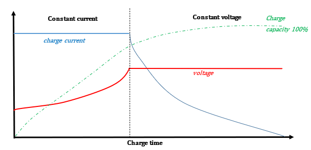

# CCCV CHARGE

## Table of Contents
- [General information](#general-information)
- [How to use](#how-to-use)

## General information

**Theoretical notions**\
*Constant current* charging is a method of continuously charging a rechargeable battery at a constant current to prevent overcurrent charge conditions. The operation continues until the voltage reaches an upper limit, which is defined by the manufacturer and is typically 4.20 V for lithium-ion batteries

*Constant voltage* charging is a method of charging at a constant voltage to prevent overcharging. The charging current is initially high then gradually decreases, until it reaches a lower limit, which is defined by the manufacturer and is typically 200 mA for lithium-ion batteries

**Goal**\
Charge the cell to full-state, i.e. 100% State-of-Charge.

**Test conduction**\
Initially the battery is charged in CC mode with a constant current charge rate C/2 until the voltage reaches a predetermined value (Vlimreal); then the operating mode switches to CV and the charging process continues until the current drops from the CC value to a specific threshold value (Ilim).

## How to use
- Connect the battery to the instrument.
- [Connect the instrument to the PC](../../DOCS/Keysight_regenerative_power_supply/Interface_Connections.pdf).
- Run the Matlab script [mainCCCV.m](mainCCCV.m).
- A .mat file is created in the output folder where the significant data is saved:
  - Data collected performing the test:
    - Time array (`s`)
    - Current array (`A`)
    - Voltage array (`V`)

## Authors
[Lorenzo Colturato](https://github.com/lorecol)\
[Paolo Furia](https://github.com/paolofuria99)

## License
This project is licensed under the MIT License - see the [LICENSE](../../LICENSE) file for details